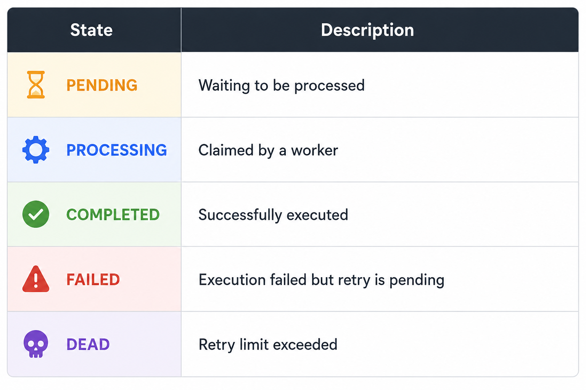
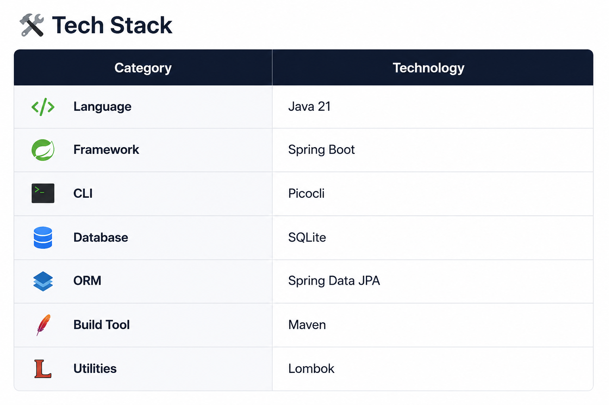
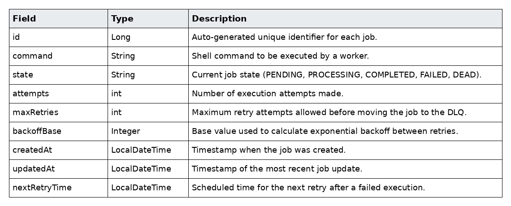
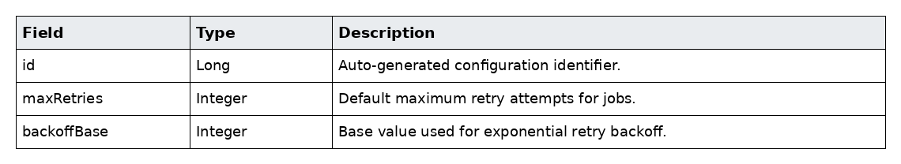
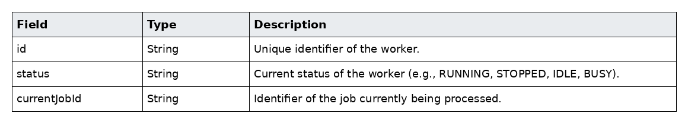
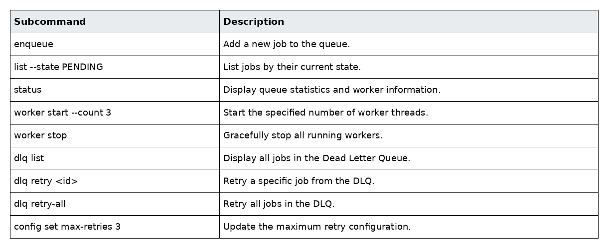
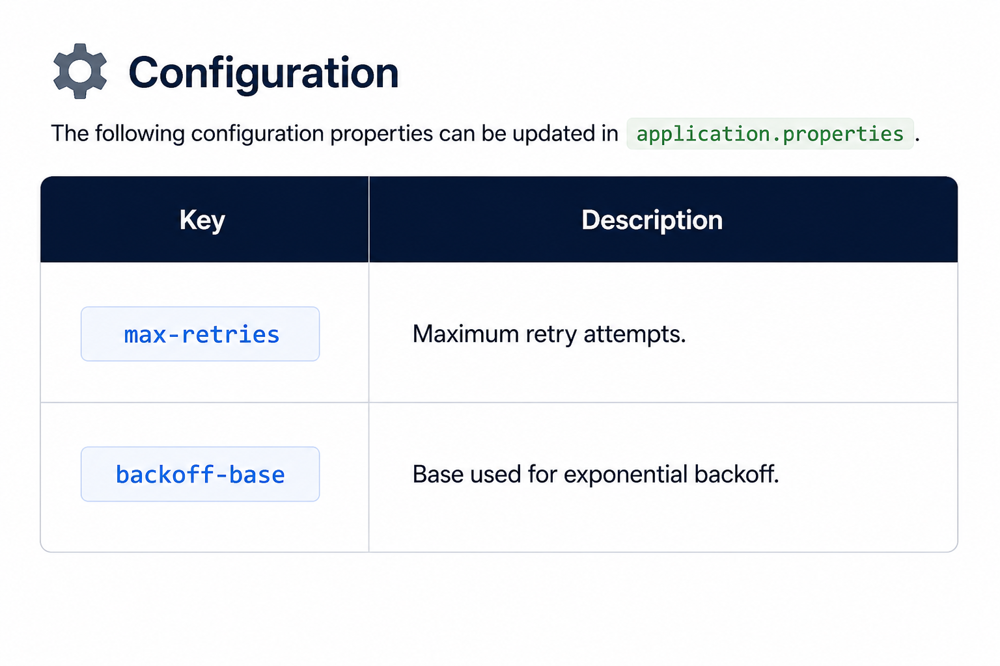
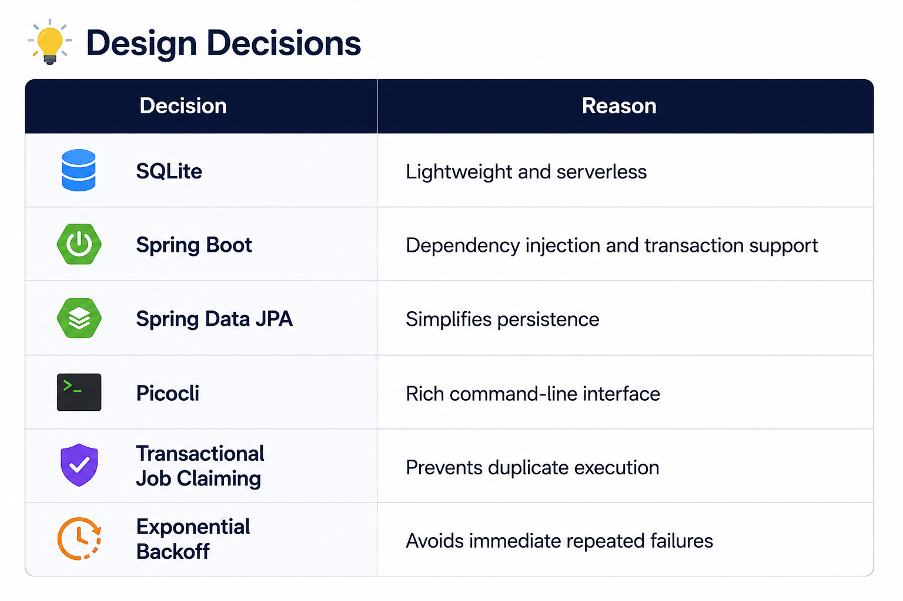

# QueueCTL

A production-inspired CLI-based background job queue built with **Java 21**, **Spring Boot**, **Picocli**, and **SQLite**.

QueueCTL is a lightweight command-line application for managing and processing asynchronous background jobs. It demonstrates many concepts used in production job processing systems, including concurrent worker execution, transactional job locking, persistent job storage, automatic retries with exponential backoff, configurable retry policies, and a Dead Letter Queue (DLQ) for permanently failed jobs.

Developed as part of the **Backend Developer Internship Assignment**, QueueCTL showcases how enterprise-grade job queues coordinate workers safely while ensuring reliability, fault tolerance, and persistence.

---

# Overview

Many real-world applications perform operations that should not block the main application flow.

Examples include:

- Sending emails
- Processing uploaded files
- Running scheduled scripts
- Report generation
- Data synchronization
- Image processing

Instead of executing these operations immediately, applications push them into a background queue where workers process them asynchronously.

QueueCTL simulates this architecture using a command-line interface while implementing features commonly found in enterprise job processing systems.

---

# Features

- 🚀 CLI-based background job management
- ⚡ Concurrent worker execution
- 💾 Persistent SQLite storage
- 🔁 Automatic retries with exponential backoff
- ☠ Dead Letter Queue (DLQ)
- 🔒 Transaction-safe job locking
- ⚙ Configurable retry policies
- 📊 Queue status monitoring
- 🧩 Modular Spring Boot architecture
- 📝 Graceful worker shutdown

---

# System Architecture


---
                     +-----------------------------+
                     |          QueueCTL           |
                     |    Spring Shell CLI         |
                     +-------------+---------------+
                                   |
          -------------------------------------------------------
          |              |              |            |           |
          ▼              ▼              ▼            ▼           ▼

    Job Service    Worker Service   DLQ Service  Retry Service  Config Service
          |              |              |            |           |
          +--------------+--------------+------------+-----------+
                                 |
                                 ▼
                       Spring Data JPA Repositories
                                 |
                                 ▼
                          SQLite Database

---

# Components

### CLI Layer

Receives user commands using **Picocli** and delegates them to the appropriate service layer.

### Job Service

Responsible for core job management operations, including:

- Enqueuing new jobs
- Listing jobs by state
- Retrieving job details
- Updating job states

### Worker Service

Responsible for worker management and job execution by:

- Starting and stopping worker threads
- Polling pending jobs
- Executing shell commands
- Updating job execution status
- Ensuring graceful shutdown

### Retry Service

Handles automatic retry processing by:

- Calculating exponential backoff delays
- Scheduling failed jobs for retry
- Tracking retry attempts
- Moving jobs to the Dead Letter Queue after the retry limit is reached

### DLQ Service

Manages Dead Letter Queue operations, including:

- Listing dead jobs
- Retrying a specific dead job
- Retrying all dead jobs
- Resetting jobs for reprocessing

### Configuration Service

Stores and manages application-wide settings such as:

- Maximum retry count
- Exponential backoff base
- Runtime configuration updates

### Persistence Layer

Uses **Spring Data JPA** with **SQLite** to persist:

- Job data
- Application configuration
- Retry scheduling information
---

# Job Lifecycle

Every job transitions through predefined states during execution.

```
                 PENDING
                    │
                    ▼
              PROCESSING
                    │
          ┌─────────┴─────────┐
          │                   │
          ▼                   ▼
     COMPLETED            FAILED
                              │
                      Retry Available?
                      │             │
                    YES             NO
                      │             │
                      ▼             ▼
              Backoff Delay      DEAD (DLQ)
                      │
                      ▼
                 PROCESSING
```
<p align="left">
  
</p>

---

# 🛠 Tech Stack

---

<p align="left">
  
</p>


---

# Project Structure

```text
queuectl/
├── src/
│   ├── main/
│   │   └── java/
│   │       └── com/
│   │           └── example/
│   │               └── queuectl/
│   │                   ├── cli/              # Picocli command classes
│   │                   ├── config/           # Application configuration
│   │                   ├── dto/              # Data Transfer Objects
│   │                   ├── entity/           # JPA entities (Job, AppConfig, etc.)
│   │                   ├── repository/       # Spring Data JPA repositories
│   │                   ├── service/          # Service interfaces
│   │                   ├── service/
│   │                   │   └── impl/         # Service implementations
│   │                   └── QueuectlApplication.java
│   ├── test/
│   │   └── java/
│   └── resources/
│       └── application.properties
│
├── queue.db                     # SQLite database
├── pom.xml                      # Maven build configuration
├── mvnw
├── mvnw.cmd                     # Maven wrapper scripts
├── README.md
└── target/                      # Compiled classes (generated)
```
---

# Database Design

## Job Table

<p align="left">
  
</p>

---

## AppConfig Table

<p align="left">
  
</p>

---

## WorkerInfo Table

<p align="left">
  
</p>

---
# CLI Commands

<p align="left">
  
</p>

---

# Getting Started

## Clone Repository

```bash
git clone https://github.com/Muskan-Seth03/Background-Job-Queue-System.git
```

## Build

```bash
mvn clean package
```

## Run

### Usage Examples

#### Enqueue a Job

```bash
java --% -jar target\queuectl-0.0.1-SNAPSHOT.jar enqueue '{"command":"echo Hello"}'
```

### Start three Workers

```bash
java --% -jar target\queuectl-0.0.1-SNAPSHOT.jar worker start --count 3
```

### List Pending Jobs

```bash
java --% -jar target\queuectl-0.0.1-SNAPSHOT.jar list --state PENDING
```

### Queue Status

```bash
java --% -jar target\queuectl-0.0.1-SNAPSHOT.jar status
```

### View Dead Jobs

```bash
java --% -jar target\queuectl-0.0.1-SNAPSHOT.jar dlq list
```

### Manage Configurations

QueueCTL supports runtime configuration through the CLI.

Available settings:

<p align="left">
  
</p>

Example

```bash
java --% -jar target\queuectl-0.0.1-SNAPSHOT.jar config set max-retries 5
```

---

# Testing

Run unit tests

```bash
mvn clean test
```

## Manual Test Scenarios

### Test 1: Successful Job Execution

**Command**

```bash
java --% -jar target\queuectl-0.0.1-SNAPSHOT.jar enqueue "{\"command\":\"echo Hello\"}"
```

**Expected Result**

```text
✓ Job enqueued successfully
✓ Worker picked the job
✓ Command executed successfully
✓ Job state: COMPLETED
```

---

### Test 2: Failed Job with Automatic Retries

**Command**

```bash
java --% -jar target\queuectl-0.0.1-SNAPSHOT.jar enqueue "{\"command\":\"invalidcommand\"}"
```

**Expected Result**

```text
✓ Job enqueued successfully
✗ Command execution failed
Retry Attempt 1
Retry Attempt 2
Retry Attempt 3
Retry limit reached
Job moved to Dead Letter Queue (DLQ)
```

---

### Verify Dead Letter Queue

```bash
java --% -jar target\queuectl-0.0.1-SNAPSHOT.jar dlq list
```

**Expected Result**

```text
ID    COMMAND           STATE
5     invalidcommand    DEAD
```

### Concurrent Workers

Start three workers.

Enqueue ten jobs.

Expected

- Every job executes exactly once.
- No duplicate execution.
- Parallel processing.

---


# Design Decisions


<p align="left">
  
</p>


---


# Worker Execution Model

Workers continuously poll the database for eligible jobs.

Execution steps

1. Find the oldest pending job.
2. Acquire a transactional lock.
3. Mark the job as **PROCESSING**.
4. Execute the shell command.
5. Update the state based on the exit code.
6. Retry or move to the DLQ if necessary.

Only one worker can claim a job at any time.

---

# Retry & Exponential Backoff

When a command fails, QueueCTL automatically retries it.

The retry delay is calculated as

```
delay = backoffBase ^ attempts
```

After the configured retry limit, the job is moved to the Dead Letter Queue.

---

# Dead Letter Queue (DLQ)

Jobs that exceed the configured retry limit are automatically marked as **DEAD** and moved to the **Dead Letter Queue (DLQ)** for manual inspection or reprocessing.


### Supported Operations

#### View Dead Jobs

---
```bash
java --% -jar target\queuectl-0.0.1-SNAPSHOT.jar dlq list
```

#### Retry a Specific Dead Job

```bash
java --% -jar target\queuectl-0.0.1-SNAPSHOT.jar dlq retry job-1
```

#### Retry All Dead Jobs

```bash
java --% -jar target\queuectl-0.0.1-SNAPSHOT.jar dlq retry-all
```
---

Retrying a DLQ job resets its state to **PENDING**.


# Concurrency Control

QueueCTL prevents duplicate execution using transactional job claiming.

```
Worker 1
    │
    ├── Claim Job
    │
    ▼
 PROCESSING

Worker 2
    │
    └── Job Already Claimed
            │
            ▼
      Pick Next Job
```

This guarantees that every job is processed exactly once.

---

# Persistence

QueueCTL stores all application data inside **SQLite**.

Persisted data includes

- Jobs
- Retry information
- Configuration
- Worker metadata

Jobs remain available even after application restart.

---


# Future Improvements

- REST API
- Docker support
- Job priorities
- Scheduled jobs
- Job timeout
- Execution logs
- Metrics dashboard
- Web UI
- Distributed workers
- RabbitMQ integration

---

# License

This project was developed for educational purposes as part of a Backend Developer Internship Assignment.

Feel free to fork, modify, and extend it for learning purposes.